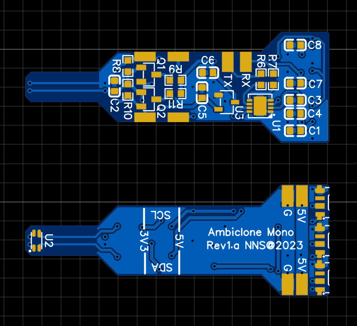
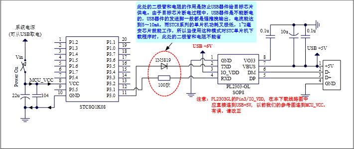

# NNS Ambiclone Mono

## WARNINGS:  
- This repository is mostly a archive.
- While the modules and the code works, color sensor is too low to allow the modules to work as wanted.
- EVERYTHING here is provided as-is.
- I decided to make this repository public in case this can maybe help anyone would want to make similar project or use a STCmicro MCU.
  
  
## Introduction:  
This project try to emulate a Ambilight system by placing single board modules around a screen.  
Modules are based around a [STC STC8G1K08A](https://www.stcmicro.com/stc/stc8g1k08.html) MCU, a [Vishay VEML6040](https://www.vishay.com/product/84276/) RGBW color sensor and a [OPSCO SK6812](https://www.opscoled.com/en/product/details.html?id=7) RGB LED.  
  
  
## Board files:
  
- Modules size is a little under 15x41mm, 2 layers.
- Require 3.3v or 5v to power each boards.
- Depending on order volume, price should land between 2 and 3 dollars per completed modules (boards from JLCPCB, components from LCSC).  
  
- [Gerber files](board/gerber_rev1-a.zip)
- [BOM (csv format)](board/bom_rev1-a.csv)
- [Schematic](board/schematic_rev1-a.pdf)
  
  
## Components datasheets:
- [STC STC8G1K08A (English)](datasheets/STC8G-EN.pdf)
- [Vishay VEML6040 (English)](datasheets/Vishay-VEML6040_EN.pdf)
- [OPSCO SK6812 (Chinese)](datasheets/OPSCO-SK6812SIDE-A-RVS_CN.pdf)
  
  
## About the code:
This project meant to be compiled in VScode IDE with PlatformIO.  
Code root is in [code/](code/).  
  
Most parts of the code relies on [FwLib_STC8 by IOsetting](https://github.com/IOsetting/FwLib_STC8).  
Specific notes about FwLib_STC8:  
- If you plan to develop using it, right after starting VScode, switch PlatformIO project environment to "env:STC8G1K08A" first then compile.
- After this, switch to "env:env_editor" to avoid Intellisense syntax errors linked to SDCC syntax (no need to switch back to "env:STC8G1K08A" to compile then (until IDE restart)).
  
FwLib_STC8 files in this repository will differs from current author's git.  
Parts of the library are commented to avoid unused functions/vars inclusion overhead on flash/sram (linked to some limitations of SDCC).  
  
Firmware will be compiled to code/.pio/build/STC8G1K08A/firmware.hex  
  
  
## Burning with the modules:
Software used to burn the MCU is [STC ISP programming software](https://www.stcmicro.com/rjxz.html).  
  
Depending on the Serial USB module you use, some specific wiring may be needed.  
Sadly, the English version of the datasheet lack wiring information for peoples not using STC U8W/U8W-Mini.
If you are using a CH340 or PL2303 module (extracted from chinese datasheet, section 5.1.10, page 99):  
  
  
In order to be able to burn the program (STC-ISP):
- Disconnect 5v wire between the Serial USB module and the board to burn.
- Press "Download/Program".
- Then connect the 5v wire.
  
  
## Communicate with the modules:
Serial commands (assuming UART port not disable by DISABLE_UART1) are limited to 31 bytes per commands max (incl \r\n).  
No overflow check are performed, unsigned numbers only, assuming a value of 0 if no value provided.  

Sensor related (0 to 65535):
- 'r': Red channel amplification.
- 'g': Green channel amplification.
- 'b': Blue channel amplification.
- 'o': Output current sensor channels values (raw and corrected) to UART, >0 to enable else disabled.
  
Amplification represent the value that will be used to expand sensor channels value.  
(corrected channel value) = ((channel value) * 65535) / (amplification value)
  
  
LED related (0-1):
- 't': Led test mode (RGB cycle with given value every LED_TEST_CYCLE_DURATION milliseconds, not saved to eeprom).
  
  
EEPROM related (0-1):
- 's1': Save sensor channels amplification values to eeprom.
- 'e1': Export eeprom sector 0 content to UART1 with Intel HEX format, recommended when flashing multiple modules.
  
  
Command examples:  
"r12b10s1" set red to 12, blue to 10, save to eeprom.  
"rgb" reset red, green, blue amplifications to 0.  
  
  
